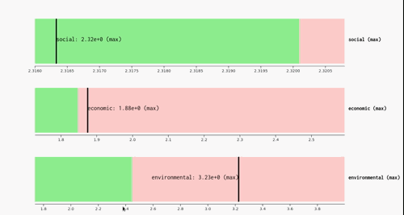
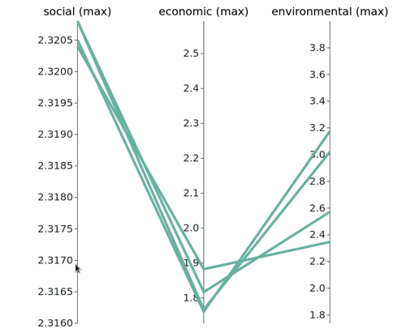
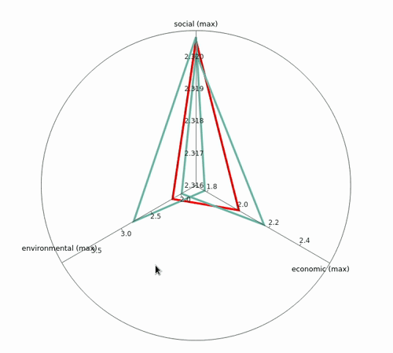
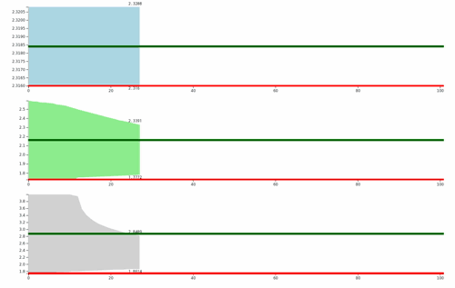

# desdeo-components
Table of contents:
  * [About](#about)
  * [Install](#install)
  * [Available visualizations](#available-visualizations)
    + [Horizontal axis plot](#horizontal-axis-plot)
    + [Parallel axis plot](#parallel-axis-plot)
    + [Radar chart](#radar-chart)
    + [Navigation bars](#navigation-bars)
  * [Documentation and examples](#documentation-and-examples)
  * [Contributing](#contributing)
  * [Development](#development)
  * [Contributors](#contributors)

## About
This pacakge is part of the larger ecosystem of packages belonging to DESDEO - a modular and open source
Python framework for multiobjective optimization. You can read more about DESDEO on
its [homepage](https://desdeo.it.jyu.fi/about).

`desdeo-components` is a collection of interactive visualization components tailored to be used specifically
in interactive multiobjective optimization. This is not a stand-alone pacakge, but is meant to be used
as a library (node module)
in larger projects. The components are implemented as [React components](https://reactjs.org/)
utilizing [d3](https://d3js.org/). While specific to interactive multiobjective optimization, the
visualization components present in this package may be used in any application, which requires that
multi-dimensional data is shown in a manner, which enables the user to interact with it. By _interact_,
we do not mean the typical way one would interact with data in a, say, dashboard application like
what [plotly](https://plotly.com/) offers, instead, the components are meant to facilitate interaction with
methods that require the user to select from a discrete set of available options or to specify
ranges for multi-dimensional data, for example.

`desdeo-components` is implemented in TypeScript.

## Install
The `desdeo-components` package can be installed as a library from npm
([desdeo-components](https://www.npmjs.com/package/desdeo-components))
as a node module to an existing project using `npm` or `yarn` (recommended):

```
    $> npm install desdeo-components
```

or (recommended)

```
    $> yarn add desdeo-components
```

## Available visualizations
Better examples will be added soon.

Currently the following components are available:

### Horizontal axis plot


### Parallel axis plot


### Radar chart


### Navigation bars


## Documentation and examples
Documentation and examples are coming soon.

## Contributing
Anyone interested is welcome to contribute to `desdeo-components`. This project is, however, part of
the research conducted at the University of Jyväskylä in the
[Multiobjective Optimization (research) Group](http://www.mit.jyu.fi/optgroup/index.html).
It is therefore a good idea to contact (one of) the maintainer(s) before starting to work on any larger
contributions to better coordinate efforts. This is not necessary, however. Anybody can fork this repository if they
so wish! But if you do so, we would greatly appreciate if you credited the original repository.

## Development
More info on locally building and testing the package coming soon.

## Contributors
Below are listed the major contributors to `desdeo-components`. If you feel you should be part of this list, make a PR.
- [Giovanni Misitano](https://github.com/gialmisi) - **maintainer**
- [Juuso Pajasmaa](https://github.com/jpajasmaa)
- [Mika Alaoutinen](https://github.com/mika-alaoutinen)

Special thanks to Mika Alaoutinen who wrote about interactie visualization components in his 
[MSc thesis](https://jyx.jyu.fi/handle/123456789/75938?show=full) and did a lot
of the groundwork. His efforts ultimately led to the current iteration of `desdeo-components`.
